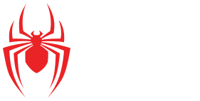

<h1 align="center">
   
</h1>

  

## 💻 Projeto
 Durante a capacitação de tecnologias da byron.solutions aprendemos sobre o framework Bootstrap 4, quais são suas ferramentas e como utilizá-las. Para a conclusão do curso foi nos passado a tarefa de criar nosso próprio site, utilizando todo o aprendizado contido no decorrer da capacitação.

## 🚀 Tecnologias utilizadas
- Html
- Css
- Javascript (Jquery)
- Bootstrap 4

## 👩‍💻 O que foi aplicado
 - Carousel
 - Cards
 - Parallax
 - Media Objects
 - Scroll Animation

## 🔖Feedback
 
A capacitação foi excelente, consegui criar um site responsivo utilizando tudo que foi ensinado nos cursos dispostos pela byron. Estou satisfeita com o resultado e em como fomos bem recebidos pela EJ, com certeza procurarei aprimorar o que foi ensinado, buscando sempre melhorar e compartilhar o que foi aprendido.

